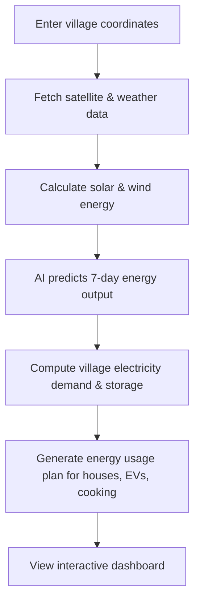

# 🌞 Powering Villages, Empowering Lives

**Smart Energy Planning Using AI & Satellite Data**

Predict renewable energy potential for villages in India using:
`#SatelliteData #AISolarPrediction #WeatherForecasts`

> “Every house gets solar power, every village gets a wind turbine, and energy is used smartly according to production and storage.”

---

## ⚡ Features

| Feature                            | Description                                |
| ---------------------------------- | ------------------------------------------ |
| ☁️ **Satellite & Weather Data**    | NASA POWER API + Open-Meteo API            |
| 🤖 **AI Solar Prediction**         | 7-day solar energy forecast using ML       |
| 🌬️ **Wind Energy Prediction**     | Wind turbine output calculation            |
| 🔋 **Energy Planning & Storage**   | Battery management & demand vs. supply     |
| 🔌 **Smart Recommendations**       | EV charging, solar cookers, stove planning |
| 🏛️ **Government-Style Dashboard** | Interactive map & charts for policymakers  |

---

## 🛠️ Tech Stack


---

## 🔄 Workflow



---

## 🔬 Energy Calculations

**Solar Energy:**

```text
Energy (kWh/day) = Solar Radiation × Panel Area × Efficiency
```

**Wind Energy:**

```text
Power (kW) = 0.5 × Air Density × Rotor Area × Wind³
```

**Energy Planning:**

* Daily demand = Number of houses × 6 kWh
* Surplus → Battery storage
* Low production → Use stored energy

---

## 🎨 Dashboard Highlights

* **Map:** Interactive district solar potential (🟢 High, 🟡 Medium, 🔴 Low)
* **Panel:** Predicted solar energy, wind speed, renewable score
* **Chart:** 7-day solar energy forecast using Chart.js
* **Globe:** 3D India renewable energy visualization with Three.js

---

## 🖼️ Output Screenshots

**Main Dashboard:**


**Energy Results:**


---

## 🚀 Getting Started

```bash
# Clone repository
git clone <repo-url>

# Install dependencies
pip install django pandas scikit-learn requests

# Run server
python manage.py runserver
```

Open browser: [http://127.0.0.1:8000](http://127.0.0.1:8000) → Enter latitude & longitude → see renewable energy plan!

---

## 🌱 Impact

* Promotes renewable energy adoption at village & household level
* Reduces pollution & fossil fuel usage
* Supports EV charging & clean cooking
* Enables smart energy storage and planning

---

## 💡 Inspiration

Inspired by **ISRO**, **NASA**, and **NREL** research in renewable energy planning and smart grids.
Smart renewable energy for villages is key to a **sustainable, pollution-free future**.

---

## 🎯 Next Steps / Ideas

* Add **real-time weather updates** for dynamic planning
* Include **battery optimization** for peak hours
* Expand dashboard to show **district-wise comparison**
* Generate **PDF reports** for village energy plans

---
